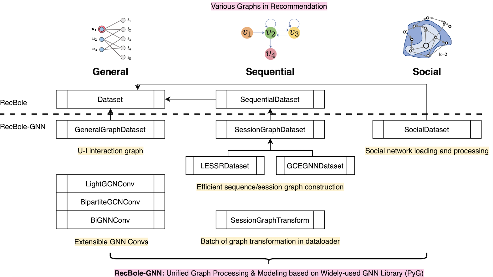

# RecBole 2.0
In order to support the study of recent advances in recommender
systems, based on a popular recommendation framework [RecBole](https://github.com/RUCAIBox/Recbole), we develop an extended recommendation library called RecBole 2.0, consisting of benchmarking packages for up-to-date topics and architectures. 

RecBole 2.0 includes 7 packages covering the up-to-date research topic in recommender system:

* Data augmentation
* Meta recommendation
* Debiased recommendation
* Fairness-aware recommendation
* Cross-domain recommendation
* Graph-based recommendation
* Transformer-based recommendation

For each package, we provide complete implementations from data loading, experimental
setup, evaluation and algorithm implementation. This library is of great value to facilitate the up-to-date research in recommender
systems. 

## [RecBole-DA](https://github.com/RUCAIBox/RecBole-DA)

## [RecBole-MetaRec](https://github.com/nuster1128/RecBole-MetaRec)

## [RecBole-debias](https://github.com/JingsenZhang/RecBole-Debias)

## [RecBole-FairRec](https://github.com/TangJiakai/RecBole-FairRec)

## [RecBole-CDR](https://github.com/RUCAIBox/RecBole-CDR)

## [RecBole-GNN](https://github.com/RUCAIBox/RecBole-GNN)
**RecBole-GNN** is a library built upon [PyTorch](https://pytorch.org) and [RecBole](https://github.com/RUCAIBox/RecBole) for reproducing and developing recommendation algorithms based on graph neural networks (GNNs). Our library includes algorithms covering three major categories:
* **General Recommendation** with user-item interaction graphs;
* **Sequential Recommendation** with session/sequence graphs;
* **Social Recommendation** with social networks.

## [RecBole-TRM](https://github.com/RUCAIBOX/RecBole-TRM)

